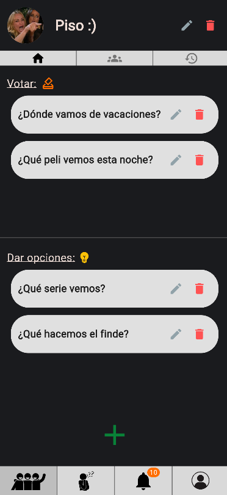
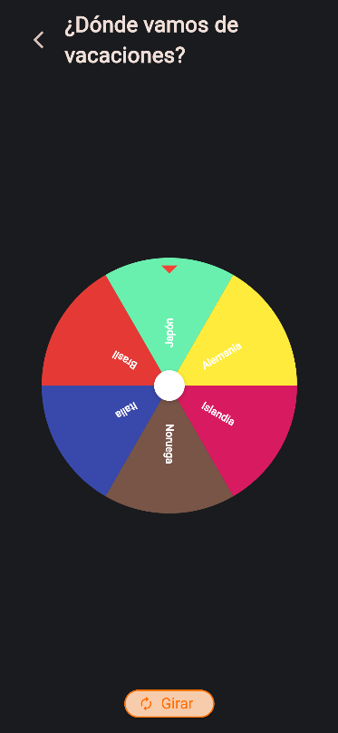
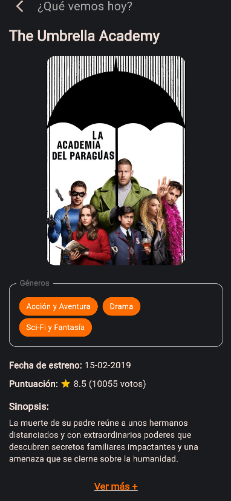

# Dego

DEGO es una aplicación móvil desarrollada en Flutter para facilitar la toma de decisiones individuales y grupales mediante diferentes sistemas de votación.

La aplicación permite crear grupos, gestionar decisiones, proponer opciones y votar utilizando distintos métodos, como votación simple, múltiple, por ranking o mediante una ruleta de desempate. Además, integra Supabase como backend para la autenticación, almacenamiento y sincronización en tiempo real, y utiliza la API de TMDB para obtener información sobre películas y series.

Este proyecto ha sido desarrollado como Trabajo Fin de Grado del Grado en Ingeniería Informática.

## Imágenes de la aplicación

<p align="center">
  
  
  
</p>

## Tecnologías utilizadas

- Flutter
- Dart
- Riverpod
- Supabase
- PostgreSQL
- Supabase Edge Functions
- TMDB API

## Características

- Autenticación de usuarios.
- Gestión de grupos.
- Creación y administración de decisiones.
- Distintos sistemas de votación.
- Sincronización en tiempo real.
- Integración con TMDB para películas y series.

## Instalación

1. Clonar el repositorio.

```bash
git clone https://github.com/usuario/dego.git
cd dego
```

2. Instalar las dependencias.

```bash
flutter pub get
```

3. Configurar las variables de entorno de Supabase y TMDB.

4. Ejecutar la aplicación.

```bash
flutter run
```

## Configuración

La aplicación requiere configurar:

- URL de Supabase.
- Clave pública (Anon Key) de Supabase.
- Clave de la API de TMDB (utilizada por las Edge Functions).

## Descarga de la aplicación

Si solo deseas probar la aplicación, puedes descargar el APK desde la sección [Releases](../../releases/latest).

Una vez descargado el archivo APK, puedes instalarlo directamente en un dispositivo Android.

## Autor
Natalia Serrano Cerceda

Trabajo Fin de Grado en Ingeniería Informática.
Universidad de Granada.
Curso 2025–2026.

## Agradecimientos

Este producto utiliza la API de TMDB, pero no está respaldado ni certificado por TMDB.

## Licencia
Este proyecto está licenciado bajo la [Licencia MIT](./LICENSE).  
